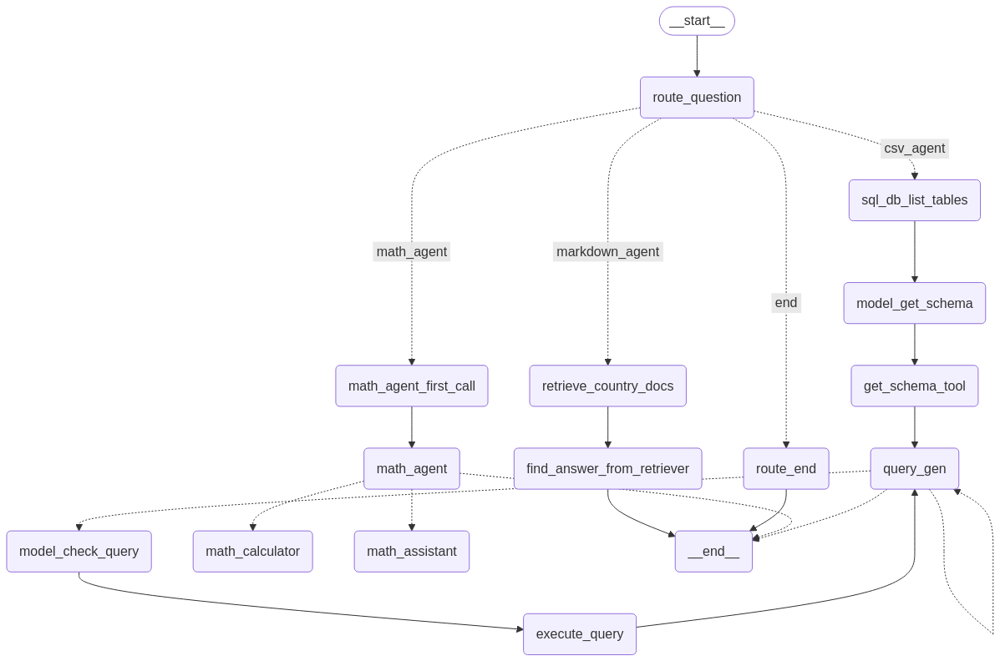

# Multi-agent-RAG Bot for Specialized Question-Answering
RAG chatbot with multiple tools support including multiple retrievers, Math tool, and Open Source LLMs.

## **Approach**

The system starts with a **[Query Router](#query-routing-with-langgraph)**, which receives the user query and directs it to the appropriate agent based on the query type. The agents include:
- **[CSV Agent](#csv-agent-handling-car-data)**: Handles car-related queries using structured data.
- **[Markdown Agent](#markdown-agent-handling-country-data)**: Manages country-related queries using unstructured markdown data.
- **[Math Agent](#math-agent-handling-mathematical-queries)**: Processes mathematical queries.
- **[Fallback Handling](#out-of-scope-query-handling)**: If the query does not match any category, the system informs the user that the query is out of scope.

A flowgraph is constructed using the **LangGraph** framework to visualize and manage the query routing process. This structured approach ensures efficient query handling while leveraging RAG principles for accurate information retrieval.


#### **Out-of-Scope Error Handling**
- If the query does not match any predefined categories, the system informs the user that it can't provide information about that question.
- Every agent also has error handling mechanisms, so that Agent can retry and itself solve errors, and in worst case reply that It does not have information about the question.

The three agents are as follows:

### 1. **CSV Agent (Handling Car Data)**
- The car data is structured, making it suitable for a **SQL-based retrieval approach**.
- The agent utilizes **table schemas and sample data** to generate SQL queries dynamically.
- A **SQL execution tool** retrieves answers based on these queries.
- **Error Handling**: Implemented mechanisms to catch and suppress errors within the tool execution.
- **Future Improvement**: Some columns, like `Description` and `Other Specifications`, contain unstructured text, making SQL-based querying insufficient. A **vector-based retriever** can be incorporated to improve performance, but this is beyond the current assignment scope.

### 2. **Markdown Agent (Handling Country Data)**
- Uses the **docling** library to extract markdown files and convert them into structured chunks.
- **Header paths** are preserved in each chunk to provide better contextual understanding.
- A **similarity search** mechanism is applied to retrieve relevant chunks.
- Retrieved documents serve as context for generating the final response.

### 3. **Math Agent (Handling Mathematical Queries)**
- Agent computes mathematical results and verifies correctness before responding.
- Uses a **Calculator** with Python's `numexpr` library to evaluate mathematical expressions.
- Employs a **Math Assistant** that applies logical reasoning to verify results and suggest corrections.

## Prerequisites
Ensure you have the following installed on your system:
- Python 3.8+
- Jupyter Notebook

### Installation
1. Create a virtual environment:
   ```sh
   python -m venv venv
   ```
2. Activate the virtual environment:
   - On Windows:
     ```sh
     venv\Scripts\activate
     ```
   - On macOS/Linux:
     ```sh
     source venv/bin/activate
     ```
3. Install dependencies:
   ```sh
   pip install -r requirements.txt
   ``` 
   
4. Add environment variables to **.env** file:
   - `GROQ_API_KEY=<Groq chat api key>`
   - `LANGSMITH_TRACING=true` (Optional) To see and debug the trace of every agent
   - `LANGSMITH_ENDPOINT=https://api.smith.langchain.com` (Optional)
   - `LANGSMITH_API_KEY=<LangSmith API Key>` (Optional)
   - `LANGSMITH_PROJECT=<Trace project>` (Optional)


5. Run all cells.